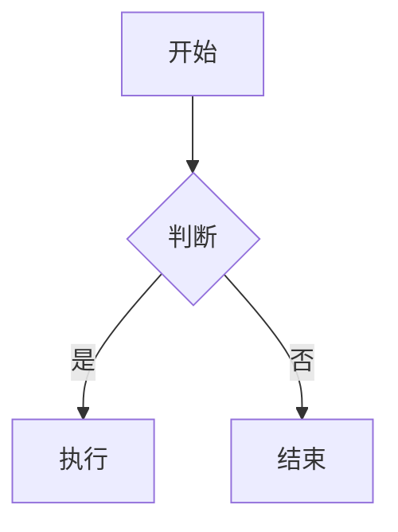
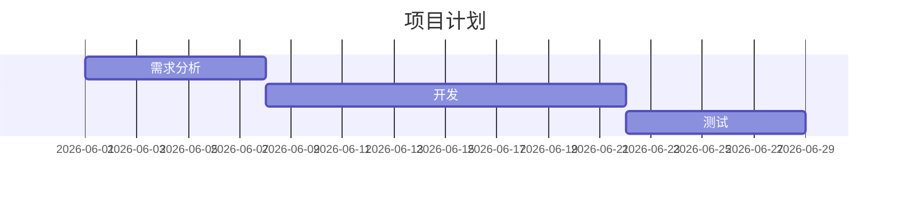

本指南是本站（基于 Jekyll + Chirpy 主题）的文章写作完整参考。即使你使用过 Jekyll，也建议浏览一遍——Chirpy 有许多独有的特性。

## 快速开始

1. 在 `_posts/` 目录下创建文件，命名格式：`YYYY-MM-DD-标题.md`
2. 在文件顶部填写 [Front Matter](#front-matter-完整参考)
3. 使用 Markdown 书写正文
4. 本地预览：`bundle exec jekyll s`
5. 推送到 GitHub 后自动部署

---

## 文件命名

```
YYYY-MM-DD-TITLE.md
```

- 日期必须正确，这是文章排序的依据
- `TITLE` 中英文均可，建议使用英文小写 + 连字符
- 扩展名仅支持 `.md` 或 `.markdown`
- 示例：`2026-06-01-getting-started.md`

---

## Front Matter 完整参考

Front Matter 是文章顶部的 YAML 配置块，用 `---` 包裹。以下是所有可用字段：

### 必需字段

```yaml
---
title: 文章标题              # 必填
date: 2026-06-01 12:00:00 +0800  # 必填，含时区
---
```

### 可选字段速查

| 字段 | 类型 | 默认值 | 说明 |
|------|------|--------|------|
| `author` | string | `_config.yml` 中的 `social.name` | 作者标识，对应 `_data/authors.yml` |
| `categories` | list | 无 | 分类，最多 2 级，如 `[技术, 前端]` |
| `tags` | list | 无 | 标签，不限数量，建议全小写 |
| `description` | string | 文章首段截取 | 文章摘要，用于 SEO 和首页展示 |
| `pin` | boolean | `false` | 设为 `true` 置顶 |
| `toc` | boolean | `true` | 是否显示右侧目录 |
| `comments` | boolean | `true` | 是否开启评论 |
| `math` | boolean | `false` | 是否启用数学公式（MathJax） |
| `mermaid` | boolean | `false` | 是否启用 Mermaid 图表 |
| `render_with_liquid` | boolean | `true` | 设为 `false` 可在文章中展示 Liquid 代码 |
| `image` | string/object | 无 | 文章预览图 |
| `media_subpath` | string | 无 | 媒体资源的路径前缀 |

### 完整示例

```yaml
---
title: 我的文章标题
author: wylx2
date: 2026-06-01 12:00:00 +0800
categories: [技术, 前端]
tags: [javascript, css, tutorial]
description: 这是一篇关于前端开发的文章。
pin: false
toc: true
comments: true
math: false
mermaid: false
image:
  path: /assets/img/cover.jpg
  alt: 封面图片描述
---
```

### 分类与标签的使用规则

- **分类** ≤ 2 级：`[主分类, 子分类]`。分类用于面包屑导航和归档页面
- **标签** 数量不限，建议全小写英文（如 `tutorial`）或简短中文（如 `教程`）
- 分类和标签会自动生成索引页面，可在 `/categories/` 和 `/tags/` 查看

### 作者配置

在 `_data/authors.yml` 中定义作者信息：

```yaml
wylx2:
  name: wylx
  twitter: your_twitter
  url: https://github.com/wylx-2
```

然后在文章中使用：

```yaml
author: wylx2
```

---

## Markdown 写作语法

### 标题层级

```markdown
# H1 — 一级标题（文章标题已占用，正文建议从 H2 开始）
## H2 — 二级标题
### H3 — 三级标题
#### H4 — 四级标题
```

> 文章标题本身是 H1，正文中最高使用 H2。层次不要太深，H2-H3 通常够了。

### 文本格式

```markdown
**粗体**  __粗体__
*斜体*  _斜体_
`行内代码`
~~删除线~~
<kbd>按键</kbd>
<u>下划线</u>
```

### 列表

```markdown
1. 有序列表第一项
2. 有序列表第二项
   1. 嵌套子项
3. 有序列表第三项

- 无序列表
  - 嵌套子项
    - 更深一层

- [ ] 待办事项
- [x] 已完成事项
```

### 引用

```markdown
> 这是一段引用文字。
```

### 表格

```markdown
| 左对齐 | 居中 | 右对齐 |
| :----- | :--: | -----: |
| 内容   | 内容 | 内容   |
```

### 脚注

```markdown
这是一段带有脚注的文字[^note]。

[^note]: 这是脚注的内容。
```

### 链接

```markdown
[显示文字](https://example.com)
<https://example.com>    <!-- 自动链接 -->
```

---

## 提示块（Prompt）

四种提示类型，视觉上有不同颜色和图标：

```markdown
> 这是 `tip` 类型的提示。
{: .prompt-tip }

> 这是 `info` 类型的提示。
{: .prompt-info }

> 这是 `warning` 类型的提示。
{: .prompt-warning }

> 这是 `danger` 类型的提示。
{: .prompt-danger }
```

使用场景：
- `tip`：技巧、建议、最佳实践
- `info`：补充说明、注意事项
- `warning`：可能导致问题的行为
- `danger`：危险操作、不兼容的写法

---

## 代码块

### 基础用法

````markdown
```python
def hello():
    print("Hello, World!")
```
````

### 带文件名

````markdown
```python
# code here
```
{: file="hello.py" }
````

### 隐藏行号

````markdown
```shell
echo "无行号"
```
{: .nolineno }
````

### 强调文件路径（行内）

```markdown
`/path/to/file.ext`{: .filepath}
```

### 支持的语法高亮语言

`bash` `shell` `python` `javascript` `typescript` `html` `css` `sass` `yaml` `json` `markdown` `ruby` `cpp` `java` `go` `rust` `sql` `matlab` 等。

> 不要使用 Jekyll 的 `` 标签，Chirpy 不支持。

---

## 数学公式

首先在 Front Matter 中启用：

```yaml
math: true
```

### 块级公式

```markdown
$$
E = mc^2
$$
```

> 块级公式 `$$` 前后**必须**各有一个空行。

### 带编号的公式

```markdown
$$
\begin{equation}
  \sum_{n=1}^\infty 1/n^2 = \frac{\pi^2}{6}
  \label{eq:basel}
\end{equation}
$$

引用公式：\eqref{eq:basel}
```

### 行内公式

```markdown
质能方程 $$E = mc^2$$ 由爱因斯坦提出。
```

> 行内公式的 `$$` 前后不能有空行。

### 列表中的行内公式

```markdown
1. \$$ E = mc^2 $$
2. \$$ F = ma $$
```

> 列表中需要对第一个 `$` 转义，即写成 `\$$`。

---

## Mermaid 图表

首先在 Front Matter 中启用：

```yaml
mermaid: true
```

### 流程图

````markdown

````

### 甘特图

````markdown

````

### 其他支持的类型

`sequenceDiagram` `classDiagram` `stateDiagram` `erDiagram` `pie` `gitGraph`

---

## 图片

### 基础插入

```markdown

```

### 图片题注

```markdown

_这是图片下方的题注_
```

### 指定尺寸

```markdown
{: width="700" height="400" }
<!-- 或简写 -->
{: w="700" h="400" }
```

> SVG 图片必须至少指定宽度，否则无法渲染。

### 图片位置

```markdown
{: .normal }   <!-- 常规左对齐 -->
{: .left  }    <!-- 左浮动（文字环绕） -->
{: .right }    <!-- 右浮动（文字环绕） -->
```

> 浮动图片不支持添加题注。

### 阴影效果

```markdown
{: .shadow }
```

### 深色/浅色模式适配

```markdown
{: .light }
{: .dark }
```

### 文章预览图

在 Front Matter 中设置，用于首页卡片和社交媒体分享：

```yaml
image:
  path: /assets/img/cover.jpg
  alt: 图片描述
  lqip: /path/to/low-quality-placeholder  # 可选，缩略图占位
```

或简写：

```yaml
image: /assets/img/cover.jpg
```

> 预览图建议尺寸 `1200 x 630` 像素，宽高比 1.91:1。

### 图片路径前缀

如果一篇文���有大量图片，可以在 Front Matter 中设置统一前缀：

```yaml
media_subpath: /assets/img/post-name/
```

然后在正文中直接用文件名：

```markdown

<!-- 实际路径：/assets/img/post-name/image.png -->
```

---

## 视频

### YouTube

```liquid

```

例如 URL `https://www.youtube.com/watch?v=H-B46URT4mg`，ID 是 `H-B46URT4mg`。

### Bilibili

```liquid

```

### Twitch

```liquid

```

### 本地视频

```liquid

```

参数说明：
- `src`：视频文件路径（必填）
- `poster`：封面图
- `title`：视频下方标题
- `autoplay`：自动播放
- `loop`：循环播放
- `muted`：静音
- `types`：备用格式，用 `|` 分隔

---

## 音频

```liquid

```

---

## 目录（TOC）

- 全局默认开启（`_config.yml` → `toc: true`）
- 在 Front Matter 中控制单篇文章：`toc: false` 关闭
- 目录自动从 Markdown 标题生成，显示在文章右侧

---

## 评论系统

本站在 `_config.yml` 中支持三种评论系统：

| 系统 | 特点 |
|------|------|
| Disqus | 最流行，需注册 |
| Utterances | 基于 GitHub Issues，开源 |
| Giscus | 基于 GitHub Discussions，推荐 |

配置示例（Giscus）：

```yaml
comments:
  provider: giscus
  giscus:
    repo: wylx-2/wylx-2.github.io
    repo_id: xxx
    category: Announcements
    category_id: xxx
```

在单篇文章中关闭评论：

```yaml
---
comments: false
---
```

---

## 文章置顶与排序

```yaml
---
pin: true
---
```

- 设 ��后文章固定在首页顶部
- 多篇置顶按发布日期倒序排列
- 使用场景：写作指南、公告、个人介绍等常驻内容

---

## 网站功能速览

### 页面导航

导航标签在 `_tabs/` 目录下配置，支持自定义图标：

| 文件 | 路径 | 功能 |
|------|------|------|
| `about.md` | `/about/` | 关于页 |
| `archives.md` | `/archives/` | 文章归档 |
| `categories.md` | `/categories/` | 分类索引 |
| `tags.md` | `/tags/` | 标签索引 |

### 侧边栏社交链接

在 `_data/contact.yml` 中配置，支持 GitHub、Twitter、Email 等（使用 Font Awesome 图标）。

### 文章分享

在 `_data/share.yml` 中配置，支持 Twitter、Facebook、Telegram 等，可取消注释启用 Weibo。

### PWA

`_config.yml` 中 `pwa.enabled: true`，网站支持安装为桌面应用和离线缓存。

### 深色/浅色模式

侧边栏底部有切换按钮，`_config.yml` 中可设置默认模式：

```yaml
theme_mode:   # 留空=跟随系统，或填 light/dark
```

### SEO 配置

在 `_config.yml` 中配置搜索引擎验证（Google/Bing/Baidu）和站点元数据。

### 分析统计

支持 Google Analytics、GoatCounter、Umami、Matomo、Cloudflare Web Analytics。

---

## 写作建议与规则

### 命名规范
- 文件名用英文小写 + 连字符，如 `2026-06-01-my-post.md`
- 标签用小写英文或简短中文，保持一致

### 排版规范
- 中英文之间留空格：`使用 Markdown 写作` 而非 `使用Markdown写作`
- 文章标题从 H2（`##`）开始，H1 留给页面标题
- 大段文字适当分段，避免一屏以上无分隔的纯文本

### 图片管理
- 图片放在 `assets/img/` 下按文章分文件夹，如 `assets/img/post-slug/`
- 使用 `media_subpath` 减少路径重复
- 大图建议压缩到 200KB 以内

### 前置内容
- 每篇文章写一个 `description`，用于首页摘要展示和 SEO
- 善用 `pin: true` 将重要文章置顶

### 性能注意
- `math` 和 `mermaid` 按需开启，不用的文章不要设为 `true`（会加载额外 JS）
- 图片添加 `width` 和 `height` 避免布局抖动

---

## 常见问题

**Q: 文章发布后首页不显示？**
A: 检查 Front Matter 中 `date` 是否小于或等于当前时间。未来日期不会渲染。

**Q: 代码块中需要展示 Liquid 模板语法怎么办？**
A: 在 Front Matter 中设置 `render_with_liquid: false`。

**Q: 如何草稿模式？**
A: 将文章放入 `_drafts/` 文件夹，或设置 `date` 为未来时间。

**Q: 本地预览命令？**
A: `bundle exec jekyll s`，然后访问 `http://localhost:4000`。

---

## 参考链接

- [Jekyll 官方文档](https://jekyllrb.com/docs/)
- [Chirpy 主题文档](https://github.com/cotes2020/jekyll-theme-chirpy)
- [Markdown 语法指南](https://www.markdownguide.org/)
- [MathJax 文档](https://docs.mathjax.org/)
- [Mermaid 文档](https://mermaid.js.org/)
